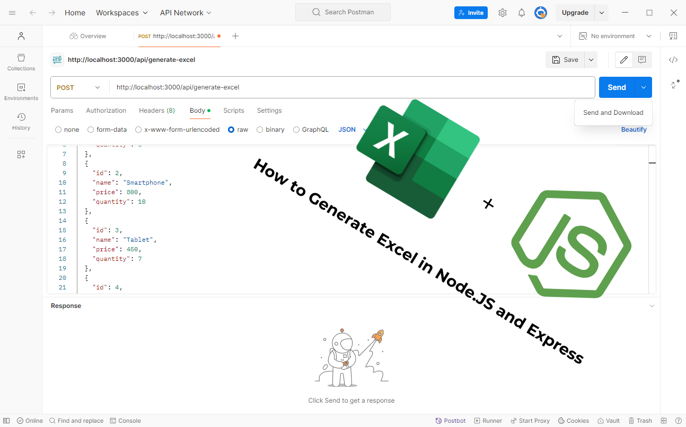
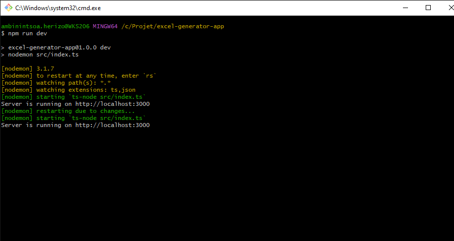
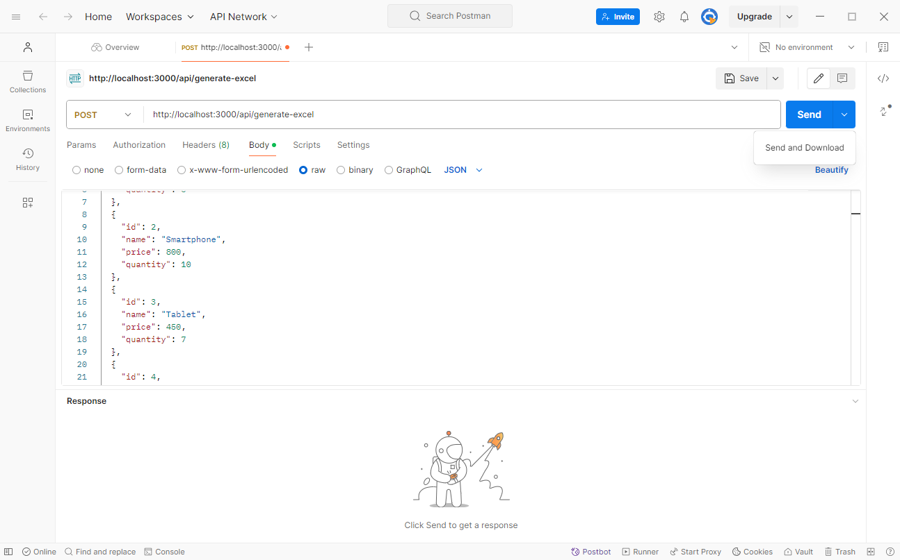

# Node.js Express Excel Generator App



## Description

This project is a **Node.js backend application** utilizing **Express** and **ExcelJS** to generate downloadable **Excel files** from **JSON data**. It provides a RESTful API endpoint that accepts JSON input, processes it, and outputs a generated Excel file for download. 

Perfect for backend developers working with **file generation**, this project highlights best practices in **Node.js** for creating **Excel files** dynamically with **JavaScript**.

## Features

- **Excel File Generation**: Transforms JSON data into an Excel file using ExcelJS, ready for download.
- **Express API Endpoint**: A POST route for JSON payload processing and Excel file output.
- **Node.js Data Streaming**: Efficiently streams the generated Excel file for direct download, improving performance.
- **Modular Architecture**: Organized with Express best practices, including controllers, services, routes, and TypeScript interfaces.

## Project Structure

Here’s an overview of the project layout:

```plaintext
└── excel-generator-app/
    ├── package-lock.json
    ├── package.json
    ├── screenshots/
    │   ├── S_node.js.png
    │   └── S_postman.png
    ├── src/
    │   ├── controllers/
    │   │   └── excelController.ts
    │   ├── index.ts
    │   ├── interfaces/
    │   │   └── productInterface.ts
    │   ├── routes/
    │   │   └── excelRoute.ts
    │   └── services/
    │       └── excelGenerationService.ts
    ├── tsconfig.json
```

## Installation

1. **Clone the repository**:
   ```bash
   git clone https://github.com/dev-luckymhz/node.js-express-excel-generator.git
   cd excel-generator-app
   ```

2. **Install dependencies**:
   ```bash
   npm install
   ```

3. **Start the development server**:
   ```bash
   npm run dev
   ```

The server will run on `http://localhost:3000`.

## Usage

1. Open [Postman](https://www.postman.com/) or any API testing tool.
2. Send a `POST` request to `http://localhost:3000/api/generate-excel`.
3. In the request body, select JSON format and include product data in JSON. Here's a sample JSON payload:

   ```json
   [
     { "id": 1, "name": "Product 1", "price": 100, "quantity": 20 },
     { "id": 2, "name": "Product 2", "price": 200, "quantity": 30 },
     { "id": 3, "name": "Product 3", "price": 300, "quantity": 15 },
     { "id": 4, "name": "Product 4", "price": 400, "quantity": 25 },
     { "id": 5, "name": "Product 5", "price": 500, "quantity": 10 }
   ]
   ```

4. In Postman, select "Send and Download" to receive the generated Excel file as a download.

## Screenshots

### 1. Console Output


### 2. Postman Request and Download


## Built With

- [Node.js](https://nodejs.org/) - JavaScript runtime environment for building backend applications.
- [Express](https://expressjs.com/) - Lightweight, flexible framework for creating APIs in Node.js.
- [ExcelJS](https://www.npmjs.com/package/exceljs) - Excel manipulation library used for backend file generation and handling in JavaScript.

## License

This project is licensed under the MIT License. See the [LICENSE](LICENSE) file for details.
